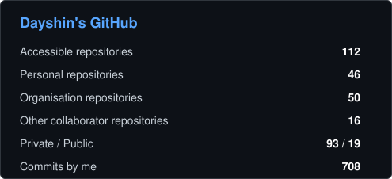

# Hey!  I'mDayshin

<h3 align="center">Software Engineer | Full-Stack & Mobile Development</h3>

  
  
  

---

### 👨‍💻 About Me

I'm a Software Engineer with **3+ years of experience** building production web and mobile applications.

I work across the stack, with most of my experience focused on **Flutter, TypeScript, React, NestJS, GraphQL and PostgreSQL**.

I enjoy building reliable software, designing clean APIs, working with scalable application architecture, and turning ideas into products people can actually use.

---

### 🛠️ Tech Stack

#### Languages

#### Mobile & Frontend

#### Backend & Data

#### Engineering & Tools

`REST APIs` · `API Design` · `CI/CD` · `OOP` · `SOLID` · `Agile/Scrum` · `K6` · `Selenium`

---

### 📊 GitHub

  

  

  

---

### 📫 Let's Connect

I'm always interested in building useful software and working on interesting engineering problems.

📧 **Email:** [dayshin.andan@gmail.com](mailto:dayshin.andan@gmail.com)  
💼 **LinkedIn:** [linkedin.com/in/mateen-andan](https://www.linkedin.com/in/mateen-andan)  
💻 **GitHub:** [github.com/dayshinA](https://github.com/dayshinA)

  

